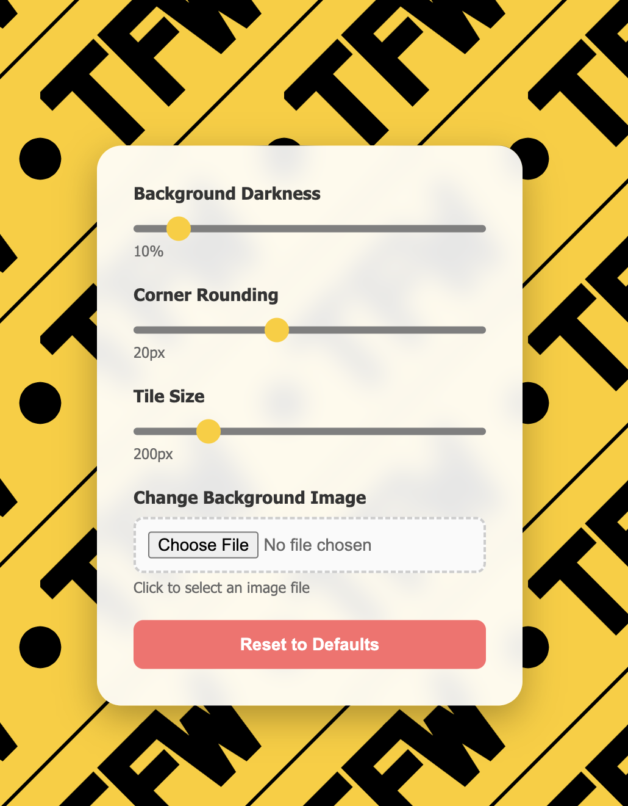

# TFW: Tile File Widget

A dynamic web tool for creating and customizing tiled background patterns. Originally designed for Team Family Wiess, this widget allows you to tile images seamlessly with interactive controls for real-time customization. Test to make sure your backgrounds as perfectly coordinated as a statue-turning jack.

## Features

- **🎨 Interactive Controls**: Real-time sliders for customizing your experience
  - **Background Darkness**: Adjust control panel transparency (0-100%)
  - **Corner Rounding**: Dynamic border radius control (0-50px)
  - **Tile Size**: Scale patterns from 10px to 1000px
  - **File Upload**: Replace background with your own images

- **🔧 Smart Design**
  - **Adaptive Colors**: Slider controls automatically match uploaded image colors
  - **High Contrast Text**: Control panel text color flips automatically for readability
  - **Embedded SVG**: Default TFW pattern included, easily editable in HTML
  - **Cross-Browser Compatible**: Works in all modern browsers

- **⚡ Single File Solution**
  - No external dependencies
  - No build process required
  - Embedded assets for offline use

## Running

1. Download the `index.html` file to your machine
2. Open it in your acabrowser (any modern web browser will do)
3. Start customizing like you're decorating the Warpig for Beer Bike!

**OR**

Visit the live demo: [TFW-Tile File Widget Demo](https://lonestarmac.github.io/TFW-Tile_File_Widget/)

## Default Pattern

The widget comes with a built-in "TFW" pattern featuring:
- Goldenrod background (#ffcc00) - as bright as the goldfish chairs in commons
- Black geometric elements and rotated text
- Endless tiling design (like the student center project!)
- Easy color customization

## Customization

### Editing the Default Pattern
The SVG pattern is embedded directly in the HTML for easy editing. Look for the `data:image/svg+xml` section in the CSS to modify:
- Colors (change `%23ffcc00` hex values)
- Text content (modify the "TFW" text)
- Geometric shapes (adjust path elements)

### Using Your Own Images
1. Click "Choose File" in the control panel
2. Select any image file (PNG, JPG, GIF, etc.)
3. The widget automatically extracts colors and updates the interface
4. Use the tile size slider to adjust pattern scale
5. Hit reset if things get start feeling like Dis-O

## Browser Support

Works in your acabrowser of choice:
- ✅ Chrome/Chromium 60+ (the speed Brown College students go the wrong way on loop road)
- ✅ Firefox 55+ (like admin on VSIP)
- ✅ Safari 12+ (those first-year students keep getting younger, right? we're still young?)
- ✅ Edge 79+ (like your prof with the scantrons)

## Technical Details

- **Pure HTML/CSS/JavaScript** - no frameworks or libraries
- **Responsive design** - if it runs doom, it runs this
- **Canvas-based color extraction** - smart image analysis for UI theming
- **Dynamic CSS injection** - real-time slider styling updates

## Issues

Found a bug or have a feature request? Please log your issue in the [GitHub issue tracker](../../issues).
*Please stop reporting Hanszen; Hanszen still sucks!*

## Contributing

Contributions welcome! Please feel free to submit pull requests for:
- Bug fixes (we squash bugs better than we squash at Beer Bike)
- New features
- UI improvements
- Documentation updates

### Development Setup
1. Fork the repository (like forking over servery swipes to Jack)
2. Try it (better than beerios!)
3. Make your changes to `index.html`
4. Test in multiple browsers (like finding space in Fonde at the end of the semester)
5. Submit a pull request

## License

This little project licensed under GPL-3.0. See COPYING for more information.

## Credits

Created for Team Family Wiess with 💛🖤💛🖤💛🖤💛🖤💛🖤💛
---

*Want to create your own tiled patterns? Fork this repo and customize the embedded SVG to match your design needs! It's easier than sweeping beer bike.*
